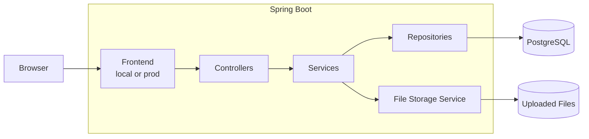

# FileFlow

A small full-stack file sharing app built mainly to learn **backend development with Java and Spring Boot**.

> **Transparency:** the frontend (HTML/CSS/JavaScript) was entirely generated with AI.  
> The purpose of this project was not to learn frontend development, but to focus on backend engineering. AI was also used as a learning assistant throughout the project.

[](https://file-management-production-01bc.up.railway.app/)


## 🚀 What it does

Upload a file → get a temporary share link → send it to someone → they can download the file.

**Limits**
- 20 MB max per file
- Link valid for 24 hours
- 5 downloads max per link

## 🧩 Two modes

| Mode | Purpose | Profile |
| --- | --- | --- |
| 🧪 Local | Pedagogical backend interface | `local` |
| 🌍 Public | Simple file sharing interface | `prod` |

```text
src/main/resources/
├── static-local/    # learning interface
└── static-public/   # public interface
```

The local version is the main learning environment of the project.  
The public version is a simplified interface used to demonstrate the backend online.

## 🛠 Tech Stack

Java 21 · Spring Boot · Spring Data JPA · Hibernate · PostgreSQL · Docker · Maven · Railway

## Architecture



- PostgreSQL stores file metadata and share links.
- File storage keeps the uploaded files.

## 💻 Run locally

```bash
docker compose up --build
```

Then open:

```text
http://localhost:8080
```

Swagger UI:

```text
http://localhost:8080/swagger-ui.html
```

Docker uses the local Spring profile:

```text
SPRING_PROFILES_ACTIVE=local
```

## Main API

```text
POST   /files/upload
GET    /files
GET    /files/{id}
PATCH  /files/{id}
DELETE /files/{id}
GET    /files/{id}/download

POST   /files/{id}/share
GET    /share/{token}
```

The simplified public interface also provides:

```text
POST /share
```

which uploads a file and directly creates a temporary share link.

## Backend concepts practiced

REST APIs · Dependency Injection · DTOs · Validation · JPA/Hibernate · Transactions · File storage · Error handling · Concurrency · Docker · Spring Profiles · Deployment
